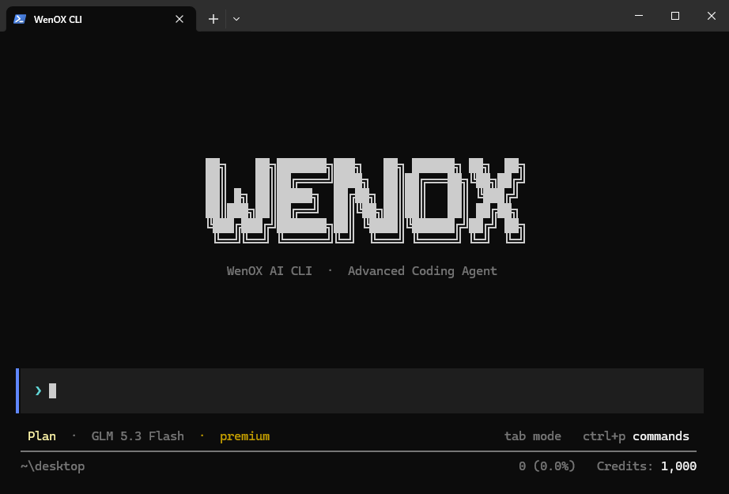

<div align="center">
  
</div>

<h1 align="center">WenOX CLI</h1>

<p align="center">
  <strong>Terminalinizde yaşayan, görev yapan bir kodlama asistanı.</strong>
</p>

<p align="center">
  <a href="https://www.npmjs.com/package/@wenox/cli"></a>
  <a href="https://www.npmjs.com/package/@wenox/cli"></a>
  <a href="LICENSE"></a>
  
</p>

<p align="center">
  Dosya okur, arar, düzenler ve oluşturur; komut çalıştırır; dil sunucusuna<br>
  sorar — hepsi WenOX AI ile, tam ekran bir terminal arayüzünde.
</p>

<p align="center">
  <a href="README.md">English</a> · <a href="README_tr.md">Türkçe</a>
</p>

<div align="center">
  
</div>

---

## ✨ Neden WenOX CLI

- **Gerçekten ajan.** Bir istem, tek bir cevap değil. Asistan iş bitene kadar araç
  çağırır — oku, ara, düzenle, çalıştır — sonra durumu bildirir.
- **Terminal için tasarlandı.** Tam ekran arayüz: çerçeveli giriş, kaydırılabilir
  sohbet, durum çubuğu ve komut paleti. Tarayıcı sekmesi yok.
- **Kontrol sizde.** Komut çalıştırmak onay ister. Proje dışına çıkmak onay ister.
  Plan modu hiçbir şeye dokunmaz.
- **Gerçek bir dil sunucusu.** Tanıma git, kullanımları bul ve hover bilgisi
  grep'ten değil, LSP sunucusundan gelir.
- **Kaldığınız yeri hatırlar.** Her konuşma kaydedilir ve başlık alır; sonra
  bıraktığınız yerden devam edersiniz.
- **Sizin dilinizi konuşur.** Arayüz Türkçe ve İngilizce; model, sizin yazdığınız
  dilde yanıtlar.


## 📦 Kurulum

```bash
npm install -g @wenox/cli
```

Node.js **20 veya üzeri**. Gerekli her şey paketle gelir — ek adım yok, derleme
yok.


## 🚀 İlk çalıştırma

`wenox` yazın, kurulum sizi adım adım karşılar:

1. **Dil** — Türkçe veya İngilizce (Enter, sistem dilini korur)
2. **API anahtarı** — Enter'a basınca anahtar sayfası tarayıcıda açılır; ya da
   anahtarı doğrudan yapıştırırsınız
3. **Doğrulama** — anahtar, kaydedilmeden önce sınanır
4. **Karşılama** — adınız, aboneliğiniz ve kalan krediniz

Anahtarınızı **[me.wenox.co/api-key](https://me.wenox.co/api-key)** adresinden
alabilirsiniz.


## 🖥️ Kullanım

```bash
wenox                                   # interaktif oturum
wenox -p "bu projede kaç dosya var?"    # tek seferlik cevap, sonra çıkar
wenox -m <id> -y                        # model seç, komutları otomatik onayla
wenox -s ses_f78edf902ffe               # kayıtlı oturuma devam et
```

| Seçenek | Açıklama |
| --- | --- |
| `-m, --model <id\|no>` | Kullanılacak model — liste için `/model` |
| `-k, --key <anahtar>` | WenOX API anahtarı (kalıcı olarak kaydedilir) |
| `-s, --session <id>` | Kayıtlı oturuma devam et |
| `-d, --cwd <yol>` | Başlangıç çalışma dizini |
| `-y, --auto-approve` | Komutları onay sormadan çalıştır |
| `-p, --prompt <metin>` | Tek seferlik komut çalıştır ve çık |
| `-v, --version` | Sürümü göster |
| `-h, --help` | Yardımı göster |


## ⌨️ Arayüz

Her komut bir kart olarak çizilir — `$` satırı ve altında çıktısı. Uzun çıktı
altı satıra kısaltılır; **karta tıklayın** tamamını görürsünüz, tekrar tıklayın
daralır.

Giriş hiç kilitlenmez. Asistan yanıtlarken yazmaya devam edebilirsiniz; mesajınız
kuyruğa alınır ve tur biter bitmez gönderilir.

| Tuş | İşlev |
| --- | --- |
| `Enter` | Gönder |
| `/` | Komut menüsü — yazdıkça filtreler, `↑/↓` seçer |
| `Tab` | Mod değiştir: **Build** / **Plan** |
| `Ctrl+P` | Komut paleti |
| `Esc` | Menüyü kapat · yanıtı **veya çalışan komutu** iptal et |
| `Ctrl+C` | Her yerde çalışır: panel kapatır, iptal eder ya da çıkar |
| `↑` / `↓` | Girdi geçmişi |
| `PgUp` / `PgDn` | Konuşmayı kaydır |
| Fare tekeri | Konuşmayı kaydır |

Metin seçmek için fareyle sürükleyin, `Ctrl+C` ile kopyalayın. Tekerleği ve
seçimi terminalinize bırakmak isterseniz `WENOX_NO_MOUSE=1` ile başlatın.


## 🧰 Yetenekler

Asistan projenizde şu araçlarla çalışır:

`read_file` · `write_file` · `edit_file` · `list_dir` · `search_code` ·
`run_command` · `code_intel` · `ask_user`

**`code_intel`** gerçek bir dil sunucusu kullanır:

| Dil | Sunucu | Kurulum |
| --- | --- | --- |
| TypeScript / JavaScript | `typescript-language-server` | `npm i -g typescript-language-server` |
| Python | `pyright-langserver` | `npm i -g pyright` |
| Go | `gopls` | `go install golang.org/x/tools/gopls@latest` |
| Rust | `rust-analyzer` | `rustup component add rust-analyzer` |

Sunucu kurulu değilse araç bunu söyler ve nasıl kurulacağını gösterir — sessizce
başarısız olmaz.

**`ask_user`** sayesinde asistan gerçekten bir karar gerektiğinde kısa, çoktan
seçmeli bir soru sorar. Kendi cevaplayabileceği şeyler için sizi darlamaz.


## 🔒 Güvenlik

- **Komutlar önce sorar.** Çalıştırma öncesi onay alınır; `-y` bunu kapatır.
- **Proje dışı önce sorar.** *Bir kez izin ver*, *Her zaman izin ver* (proje
  bazında hatırlanır) veya *Reddet* seçersiniz.
- **Güvensiz klasörler işaretlenir.** Ev dizini, sürücü kökü veya bir sistem
  klasöründe başlarsanız CLI uyarır, asistana dikkatli olmasını söyler ve
  **her** yol için izin ister — `list_dir` dahil.
- **Kendini öldüren komutlar engellenir.** Tüm Node süreçlerini öldürecek
  komutlar (`taskkill /IM node.exe`, `pkill node`, …) reddedilir; çünkü CLI'ın
  kendisi de onlardan biri.
- **`Esc` işi durdurur.** Çalışan komut, alt süreçleriyle birlikte öldürülür —
  unutulmuş bir dev server dahil.


## 🗺️ Modlar

Aktif mod durum çubuğunda görünür; `Tab` ile değiştirilir.

| Mod | Davranış |
| --- | --- |
| **Plan** — varsayılan | Salt-okunur. İnceler ve plan önerir; yazma ve komutlar engellidir. |
| **Build** | İşi bitirmek için dosya okur, düzenler ve komut çalıştırır. |

Plan'da başlayın, asistanın ne yapmayı düşündüğünü görün, sonra `Tab` ile
Build'e geçip uygulatın.


## 🌍 Diller

Arayüz Türkçe ve İngilizce; sistem dilinizden algılanır, `/lang` veya `WENOX_LANG`
ile değiştirilir.

Yalnızca arayüz çevrilir. Prompt'lar ve araç şemaları İngilizce kalır; asistan
sizin yazdığınız dilde yanıtlar.


## 💾 Oturumlar

Konuşmalar otomatik kaydedilir ve birkaç mesaj sonra başlık alır. Çıkışta terminal
nasıl dönüleceğini yazar:

```text
  Session   Selamlaşma
  Continue  wenox -s ses_f78edf902ffe
```

Devam ettiğinizde mesajlar, token sayacı, model ve çalışma dizini geri yüklenir.
`/sessions` tüm oturumları listeler ve seçtiğinizi açar.


## ⚙️ Komutlar

Her şey oturumun içinden yönetilir — modeli, dili ya da anahtarı değiştirin,
hesabı görün, bağlamı düzenleyin. Ayarlar ortam değişkenleriyle de verilebilir:
`WENOX_API_KEY`, `WENOX_DEFAULT_MODEL`, `WENOX_LANG`, `WENOX_API_BASE_URL`,
`WENOX_REQUEST_TIMEOUT_MS`.

| Komut | Açıklama |
| --- | --- |
| `/help` | Komutlar ve kısayollar |
| `/model` | Modeli değiştir |
| `/lang` | Arayüz dilini değiştir |
| `/key` | API anahtarını güncelle (kaydetmeden önce doğrulanır) |
| `/me` | Hesap ve kalan kredi |
| `/compact` | Bağlamı özetle, yer aç |
| `/new` | Bağlamı temizle |
| `/sessions` | Geçmiş oturumları listele ve yükle |
| `/auto` | Oto-onayı aç/kapat |
| `/status` | Oturum durumu |
| `/exit` | Çıkış |


## 🛠️ Geliştirme

TypeScript ile yazıldı ve `tsc` ile derleniyor. Yayınlanan paket derlenmiş
çıktıyı taşıdığı için kurulumda ek bir adım gerekmiyor.

```bash
npm install
npm run build   # derle
npm test        # derle, sonra testleri koş
npm start       # derle, sonra CLI'ı çalıştır
```


## 📄 Lisans

MIT
